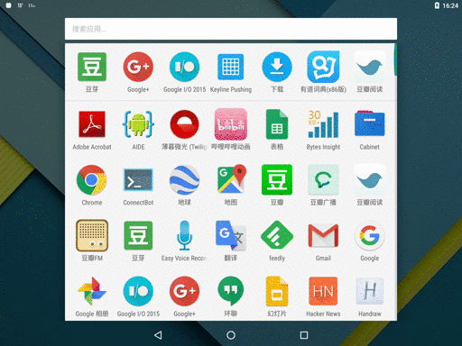

# MaterialColdStart

Utilize the window background during cold start time (the time between user launches your app and `Activity.onCreate()` is called) to make your app look faster.

This project comes with some templates for Material Designed apps, but you can also roll your own if you wish.

## Preview

Blank cold start (Glitch on status bar and appbar) v.s. Material cold start (Preserves visual consistency):


(I deliberately picked a slower device to show the effect clearer, but this improvement is also delightful on faster devices.)

When your app process is cached in memory but main activity is relaunched, this technique gives the illusion of a much quicker start up.



Notice the small period of time when appbar and status bar is "drawn" but no text is shown — **this is the trick**.

Without the help of our cold start window background, users will see a glitch of whiteness over the appbar and statusbar.

## Inspiration

This project was inspired by the pro-tip [Use cold start time effectively with a branded launch theme — Pro-tip by +Ian Lake](https://plus.google.com/+AndroidDevelopers/posts/Z1Wwainpjhd).

But instead of using a short transient product logo as preview, I want to use a background with an `AppBar` on it, just like the old days with framework-managed `ActionBar`, which gives user the illusion of a quicker start up and ensures visual consistency.

This project has been around in my mind for several months, until I found my way to generate drawables with templates.

## Implementation

This project generates nine-patch drawables for use as `android:windowBackground`.

### Why nine-patch?

Only static drawables can be loaded by framework as preview, and all other drawables will only retain aspect ratio when width/height is set. So we need to use nine-patch.

### How to generate nine-patch?

However, nine-patches need to be bitmaps, but we have various dimension sizes changing with configuration, and we still have to retain the one-pixel border while scaling up the content area.

I don't want to keep a separate file for each combination of configuration (which can be 20 if you support tablet), but instead use a single template for nine-patch generation. After a lot of (painful) trial-and-error with `XSLT` and `sed`, I suddenly found the good old `bash` (which is string-oriented) a viable solution for this problem.

The solution, a "new" format called `shsvg` (Shell SVG), is implemented as in [DreaminginCodeZH/AndroidSVGScripts](https://github.com/DreaminginCodeZH/AndroidSVGScripts) and used by this project.

## Usage

> Note: To generate your own image assets, you will probably need a Linux installation. I may upload some pre-built assets later.

1. Modify the `.conf` files to reflect the layout of your main activity.

2. Optional - adjusting the appbar height. By default the script assumes that your app does have a `TabLayout`. If however your app does not, you need to modify each `window_background_statusbar_toolbar_tab.9.shsvg.conf` file in the given raw directories and change the `APPBAR_HEIGHT` from `112` to `64` and `104` to `56`.

3. Run `gen-png.sh` and copy the output in `gen/` to your `res` directory. (requires `bash`, `inkscape` and `gcalccmd`(from `gnome-calculator`))

4. Make a new theme for your main activity:

    ```xml
    <style name="AppTheme.MaterialColdStart">
        <item name="android:windowBackground">@drawable/window_background_statusbar_toolbar_tab</item>
    </style>
    ```

5. And set the new theme in your `AndroidManifest.xml`:

    ```xml
    <activity
        android:name=".MainActivity"
        android:theme="@style/AppTheme.MaterialColdStart">

        <intent-filter>
            <action android:name="android.intent.action.MAIN" />
            <category android:name="android.intent.category.LAUNCHER" />
        </intent-filter>
    </activity>
    ```

6. Finally in your `MainActivity.java`, set the theme back for the normal window background, which will be transitioned into:

    ```java
    public class MainActivity extends AppCompatActivity {

        @Override
        protected void onCreate(Bundle savedInstanceState) {

            // Make sure this line comes before calling super.onCreate().
            setTheme(R.style.AppTheme);

            super.onCreate(savedInstanceState);
        }
    }
    ```

7. Enjoy the updated cold start experience!

## Pre-built assets

// TODO

## License

```
Copyright 2015 Zhang Hai

Licensed under the Apache License, Version 2.0 (the "License");
you may not use this file except in compliance with the License.
You may obtain a copy of the License at

   http://www.apache.org/licenses/LICENSE-2.0

Unless required by applicable law or agreed to in writing, software
distributed under the License is distributed on an "AS IS" BASIS,
WITHOUT WARRANTIES OR CONDITIONS OF ANY KIND, either express or implied.
See the License for the specific language governing permissions and
limitations under the License.
```
